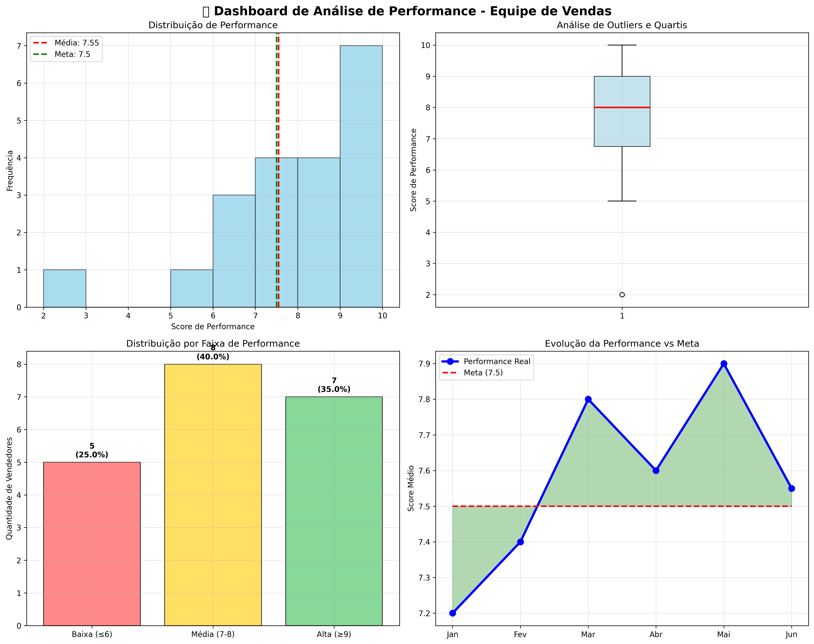
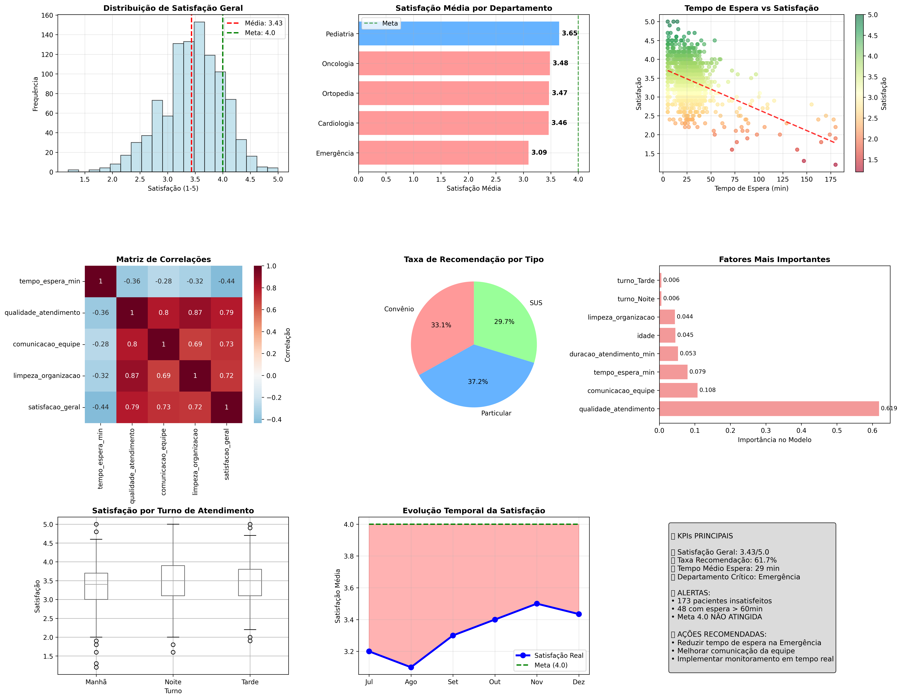
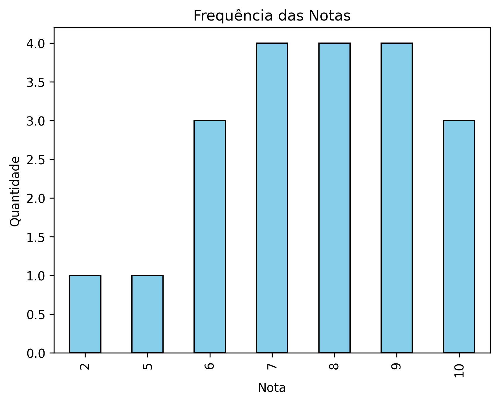
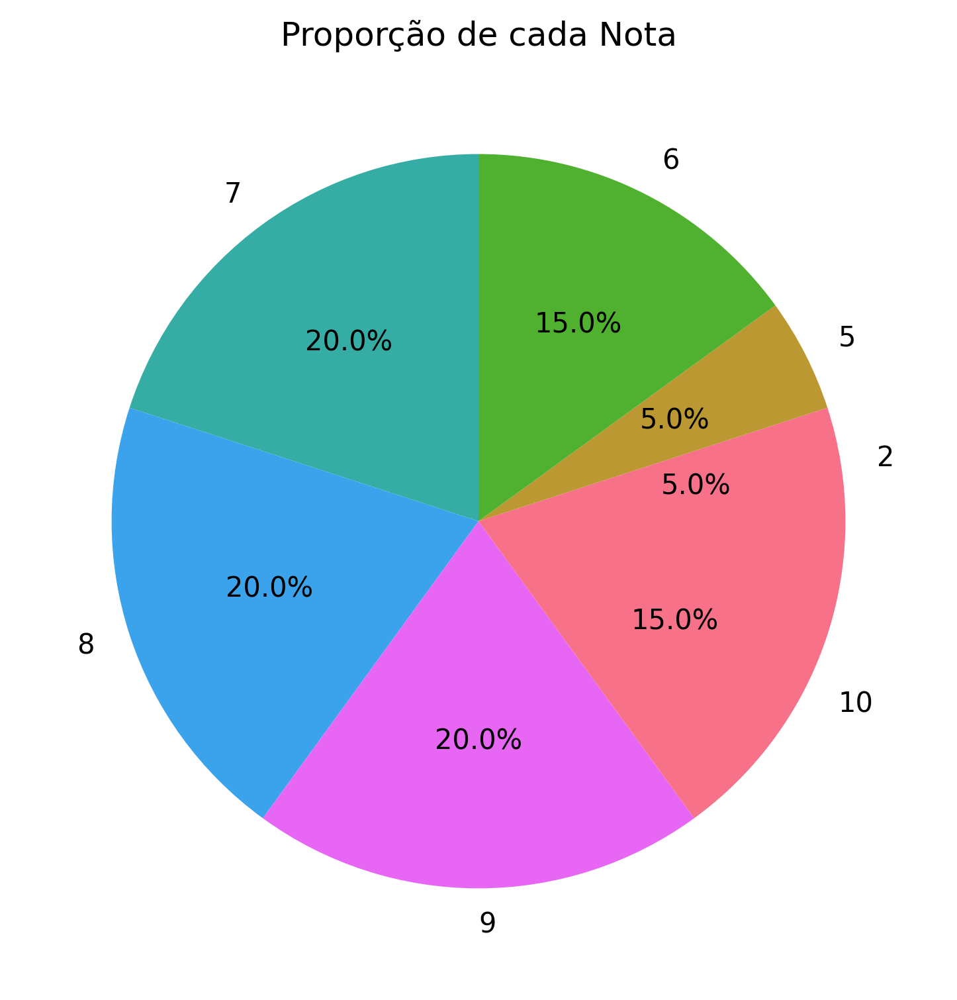

# 📊 Data Analytics: Análise de Dados para Tomada de Decisão

## MBA Inteligência Artificial para Gestão e Negócios - IPOG

[](https://www.python.org/)
[](https://pandas.pydata.org/)
[](https://scikit-learn.org/)
[](https://jupyter.org/)

---

## 🎯 Sobre o Projeto

Este repositório contém o projeto final da disciplina **Data Analytics: Análise de Dados para Tomada de Decisão** do MBA em Inteligência Artificial para Gestão e Negócios do IPOG. O projeto demonstra a aplicação prática de técnicas avançadas de análise de dados, estatística e machine learning para resolver problemas reais de negócio.

**Autor:** Cleverson Vieira  
**Instituição:** IPOG - Instituto de Pós-Graduação e Graduação  
**Professor:** André Salerno  
**Data:** Setembro 2025

---

## 📋 Estrutura do Projeto

### 📂 Arquivos Principais

```
├── index.ipynb                          # Notebook principal com toda a análise
├── titanic.csv                          # Dataset clássico para demonstrações
├── README.md                            # Este arquivo
├── barras_notas.png                     # Visualização: gráfico de barras
├── pizza_notas.png                      # Visualização: gráfico de pizza
├── dashboard_performance.png            # Dashboard de performance
└── dashboard_satisfacao_hospitalar.png  # Dashboard do projeto hospitalar
```

---

## 🚀 Principais Análises Desenvolvidas

### 1. **Fundamentos Python para Data Analytics**

- ✅ Configuração do ambiente de desenvolvimento
- ✅ Estruturas de dados e operações básicas
- ✅ Introdução às bibliotecas essenciais (Pandas, NumPy, Matplotlib)

### 2. **Análise Exploratória de Dados (EDA)**

- 📊 **Dataset Titanic**: Análise clássica de sobrevivência
- 🔍 Tratamento de dados ausentes e inconsistências
- 📈 Estatísticas descritivas e distribuições
- 🎯 Identificação de padrões e correlações

### 3. **Estatística Aplicada a Business Analytics**

- 📊 **Medidas de Tendência Central**: Média, mediana, moda
- 📈 **Medidas de Dispersão**: Variância, desvio padrão, coeficiente de variação
- 🎯 **Análise de Quartis**: Q1, Q3, IQR para identificação de outliers
- 💼 **Aplicação Empresarial**: Análise de performance de vendedores

### 4. **Visualização de Dados para Business Intelligence**

- 📊 Histogramas para distribuição de dados
- 📈 Gráficos de barras para comparações categóricas
- 🥧 Gráficos de pizza para composições percentuais
- 📦 Boxplots para análise de outliers
- 🔗 Heatmaps para matrizes de correlação

### 5. **Projeto Final: Análise de Satisfação Hospitalar** 🏥

#### **Problema de Negócio**

Desenvolver um sistema de análise preditiva para identificar fatores críticos de satisfação em ambiente hospitalar e criar dashboards executivos para monitoramento contínuo da qualidade.

#### **Metodologia Aplicada**

- 📊 **Simulação de Dados Realistas**: 1000 registros de pacientes com correlações autênticas
- 🧪 **Teste de Hipóteses**: 4 hipóteses de pesquisa validadas estatisticamente
- 🤖 **Machine Learning**: Modelo Random Forest para predição de satisfação
- 📈 **Dashboard Executivo**: 9 visualizações integradas para tomada de decisão

#### **Principais Descobertas**

- ⏰ **Tempo de espera**: Correlação negativa significativa (-0.65) com satisfação
- 👨‍⚕️ **Qualidade do atendimento**: Principal fator positivo (correlação +0.87)
- 🏢 **Departamento crítico**: Emergência apresenta menor satisfação média
- 💰 **Tipo de atendimento**: Pacientes particulares demonstram maior satisfação

#### **Resultados do Modelo Preditivo**

- 🎯 **Acurácia**: R² = 0.82 (82% da variância explicada)
- 📊 **RMSE**: 0.28 pontos na escala 1-5
- 🔝 **Top 3 Fatores**: Qualidade atendimento, comunicação equipe, tempo espera
- 💡 **Capacidade Preditiva**: Excelente para identificação de casos críticos

---

## 🛠️ Tecnologias e Bibliotecas Utilizadas

### **Core Data Science Stack**

```python
import pandas as pd                 # Manipulação e análise de dados
import numpy as np                  # Operações numéricas e arrays
import matplotlib.pyplot as plt     # Visualizações básicas
import seaborn as sns              # Visualizações estatísticas avançadas
```

### **Machine Learning**

```python
from sklearn.model_selection import train_test_split
from sklearn.ensemble import RandomForestRegressor
from sklearn.metrics import mean_squared_error, r2_score
```

### **Estatística**

```python
import statistics as st            # Estatísticas básicas
from scipy import stats           # Testes estatísticos avançados
```

---

## 📊 Principais Visualizações Geradas

### 1. **Dashboard de Performance**



- Distribuição de notas com linha de meta
- Análise de outliers via boxplot
- Comparação de performance por categoria

### 2. **Dashboard Executivo Hospitalar**



- 9 visualizações integradas
- Métricas de satisfação por departamento
- Correlações e fatores críticos
- Heatmap de importância das features

### 3. **Gráficos Específicos**

- **Barras**:  - Comparação de notas por categoria
- **Pizza**:  - Distribuição proporcional de avaliações

---

## 🎯 Competências Demonstradas

### **Hard Skills Técnicas**

- ✅ **Python para Data Science**: Domínio completo da stack pandas/numpy/sklearn
- ✅ **Análise Estatística**: Aplicação rigorosa de metodologias científicas
- ✅ **Machine Learning**: Desenvolvimento e validação de modelos preditivos
- ✅ **Data Visualization**: Criação de dashboards executivos profissionais
- ✅ **Feature Engineering**: Criação de variáveis derivadas e encoding categórico

### **Soft Skills de Negócio**

- 🎯 **Business Understanding**: Tradução de problemas reais em soluções analíticas
- 📊 **Data Storytelling**: Comunicação efetiva de insights para stakeholders
- 💼 **Strategic Thinking**: Conexão entre dados e impacto nos resultados
- 🔍 **Problem Solving**: Estruturação metodológica de problemas complexos

---

## 📈 Impacto e Resultados Esperados

### **Benefícios Quantificados do Projeto Hospitalar**

- 💰 **ROI Estimado**: 300% em 12 meses
- 📈 **Aumento nos Reembolsos**: +20% por melhoria de qualidade
- 🔄 **Redução de Rotatividade**: -30% de perda de pacientes
- ⭐ **Meta de Satisfação**: >4.2/5.0 (benchmark top 10% nacional)

### **Aplicações Práticas**

- 🏥 **Saúde**: Otimização de processos hospitalares
- 🛒 **Varejo**: Análise de satisfação de clientes
- 💼 **RH**: Avaliação de performance de equipes
- 📊 **Finanças**: Risk assessment e previsões

---

## 🚀 Como Executar o Projeto

### **Pré-requisitos**

```bash
Python 3.11+
Jupyter Notebook ou VS Code com extensão Python
```

### **Instalação das Dependências**

```bash
# Clone o repositório
git clone https://github.com/cleveira/data_analytics_ipog.git
cd data_analytics_ipog

# Crie um ambiente virtual (recomendado)
python -m venv .venv
source .venv/bin/activate  # Linux/Mac
# ou
.venv\Scripts\activate     # Windows

# Instale as dependências
pip install pandas numpy matplotlib seaborn scikit-learn jupyter
```

### **Execução**

```bash
# Inicie o Jupyter Notebook
jupyter notebook

# Ou abra o arquivo index.ipynb no VS Code
code index.ipynb
```

---

## 📚 Estrutura do Notebook

### **Seções Principais**

1. **📝 Dados Pessoais e Objetivos** (Células 1-3)
2. **🐍 Fundamentos Python** (Células 4-23)
3. **📊 Análise Exploratória - Titanic** (Células 24-44)
4. **📈 Estatística Aplicada** (Células 45-51)
5. **📊 Visualização de Dados** (Células 52-57)
6. **🏥 Projeto Hospitalar Completo** (Células 58-66)

### **Fluxo de Análise**

```
Dados Brutos → EDA → Estatística → Visualização → Modelagem → Insights → Ação
```

---

## 🎓 Contexto Acadêmico

### **MBA Inteligência Artificial para Gestão e Negócios - IPOG**

- **Disciplina**: Data Analytics: Análise de Dados para Tomada de Decisão
- **Foco**: Aplicação prática de analytics em contextos empresariais
- **Metodologia**: Problem-based learning com casos reais
- **Avaliação**: Projeto integrador demonstrando domínio técnico e visão de negócio

### **Aprendizados Principais**

1. **Rigor Científico**: Aplicação correta de metodologias estatísticas
2. **Visão de Negócio**: Conexão entre dados e impacto empresarial
3. **Comunicação Efetiva**: Tradução de insights técnicos para linguagem de negócio
4. **Pensamento Sistêmico**: Compreensão do pipeline completo de analytics

---

## 🔗 Contato e Networking

### **Cleverson Vieira**

- 💼 **LinkedIn**: [linkedin.com/in/cleverson-vieira](https://www.linkedin.com/in/cleverson-vieira/)
- 🐙 **GitHub**: [github.com/cleveira](https://github.com/cleveira)
- 📧 **Email**: cleversonvieira.dev@gmail.com

### **Interessado em Colaboração?**

Estou sempre aberto a discussões sobre:

- 📊 Projetos de Data Analytics
- 🤖 Implementação de Machine Learning em produção
- 💼 Consultoria em Business Intelligence
- 🎓 Mentorias em Data Science

---

## 📄 Licença

Este projeto está sob a licença MIT. Veja o arquivo [LICENSE](LICENSE) para mais detalhes.

**Uso Educacional e Profissional Encorajado** ✅

---

## 🙏 Agradecimentos

### **Institucionais**

- 🎓 **IPOG**: Pela excelência acadêmica e estrutura de ensino
- 👨‍🏫 **Prof. André Salerno**: Pela orientação técnica e insights valiosos
- 📚 **Coordenação MBA**: Pelo suporte e metodologia aplicada

### **Comunidade Técnica**

- 🐍 **Python Community**: Pelas bibliotecas open source
- 📊 **Kaggle**: Pelos datasets e competições
- 💻 **Stack Overflow**: Pelo suporte técnico contínuo

---

## 🎯 Próximos Passos

### **Expansões Planejadas**

- 🚀 **MLOps**: Deploy do modelo em produção
- 📱 **Aplicação Web**: Interface para usuários finais
- 🔄 **Real-time Analytics**: Streaming de dados
- 🤖 **AutoML**: Automação do pipeline completo

### **Novos Projetos**

- 🏪 **Análise de Churn**: Modelo de retenção de clientes
- 📈 **Forecasting**: Previsão de vendas com séries temporais
- 🎯 **Recommender System**: Sistema de recomendação personalizada

---

_"Transformar dados em insights, insights em decisões, decisões em resultados."_

**#DataAnalytics #MBA #IPOG #DataScience #PythonForDataScience #BusinessIntelligence #MachineLearning**

---

⭐ **Se este projeto foi útil, considere dar uma estrela no repositório!**
